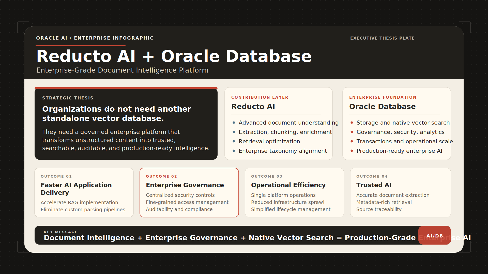

# Reducto OracleDB Starter Kit

Oracle-owned reference pipeline for Reducto Extract API and Oracle 23ai JSON storage.

Reducto Extract pulls schema-defined fields from complex documents and returns
typed JSON with optional citations on each value. Oracle 23ai stores the schema,
the Extract API response, and the full raw Reducto payload as JSON so the result
can be audited, queried, and reused. The repository also keeps the earlier parse
and vector retrieval path as an optional RAG companion workflow.



## What This Builds

- Pass a document URL or uploaded file to Reducto.
- Call `client.extract.run(...)` through the official `reductoai` SDK for
  schema-typed extraction.
- Store schema-typed Reducto Extract JSON, with optional citations, in Oracle JSON.
- Store the Extract request schema and full raw Reducto response for traceability.
- Demonstrate the active `/api/extract/url` demo path end to end.
- Keep `client.parse.run(...)` available for optional chunk/vector/RAG ingestion.
- Handle both inline Reducto parse results and URL-based large parse results.
- Store chunks in Oracle with `VECTOR(dim, FLOAT32)` embeddings.
- Promote Reducto table blocks into relational `financial_facts`.
- Query chunks semantically and query financial metrics with SQL.

## Project Layout

```text
src/reducto/lib/oracledb/
  reducto_client.py   Reducto upload/parse/extract wrapper
  normalizer.py       Inline and fetched parse-result normalization
  table_parser.py     CSV/Markdown/HTML table extraction and fact promotion
  oracle.py           Oracle schema creation and ingestion repository
  retrieval.py        Vector, hybrid, and financial-fact retrieval
examples/oracledb/
  sql/schema.sql        Reference DDL
  docs/architecture.md  Pipeline diagram
  docs/integration-plan.md
  ingest_10k.py         Minimal parse-and-store example
  demo/                 Browser demo
  scripts/              Maintenance helpers
```

## 1. Install

```bash
cd reducto-python-sdk
./scripts/bootstrap
source .venv/bin/activate
```

The bootstrap command follows the SDK's contributor setup and installs all
features, including the optional `oracledb` dependency. Without Rye, create and
activate a virtual environment, then run
`python -m pip install -r requirements-dev.lock` as described in
`CONTRIBUTING.md`.

## 2. Where To Keep The Reducto API Key

Keep it out of source control. Use shell environment variables or a local `.env`
copied from the example template.

```bash
cp examples/oracledb/.env.example examples/oracledb/.env
```

Edit `examples/oracledb/.env`, then load it before running commands:

```bash
set -a
source examples/oracledb/.env
set +a
```

The important key is:

```bash
export REDUCTO_API_KEY="red-YOUR_KEY"
```

The Reducto SDK automatically reads `REDUCTO_API_KEY`. This starter kit also
honors `REDUCTO_ENVIRONMENT=production`, `eu`, or `au`.

## 3. Set Up Oracle 23ai Free

Start Oracle Database Free in Docker:

```bash
docker run -d \
  --name oracle23ai-free \
  -p 1521:1521 \
  -e ORACLE_PWD='OraclePwd123' \
  container-registry.oracle.com/database/free:latest
```

Create an application user from SQL*Plus, SQLcl, SQL Developer, or any Oracle
admin client:

```sql
ALTER SESSION SET CONTAINER = FREEPDB1;

CREATE USER REDUCTO_RAG IDENTIFIED BY "change-me";
GRANT CREATE SESSION, CREATE TABLE, CREATE SEQUENCE, CREATE VIEW,
      CREATE PROCEDURE, CREATE TRIGGER, CREATE TYPE TO REDUCTO_RAG;
GRANT UNLIMITED TABLESPACE TO REDUCTO_RAG;
```

Set connection variables:

```bash
export ORACLE_USER=REDUCTO_RAG
export ORACLE_PASSWORD='change-me'
export ORACLE_DSN='localhost:1521/FREEPDB1'
export ORACLE_VECTOR_DIMENSIONS=2048
export EMBEDDING_PROVIDER=oracle
export ORACLE_LLM_API_KEY='...'
export ORACLE_LLM_BASE_URL='https://dbdevllms.oraclecorp.com'
export ORACLE_LLM_EMBED_MODEL='nim/llama-3.2-nv-embedqa-1b-v2'
export ORACLE_LLM_EMBED_MAX_CHARS=16000
```

Create the schema:

```bash
reducto-oracledb init-db --vector-dimensions 2048
```

To enable lexical plus vector hybrid search, create the Oracle Text index too:

```bash
reducto-oracledb init-db --vector-dimensions 2048 --text-index
```

## 4. Upload Or Ingest A 10-K Filing With Parse

This path is optional and exists for chunk retrieval, table promotion, and Q&A.
The active structured-field integration is the Extract API path in the next
section.

### Option A: Pass a public SEC filing URL

```bash
reducto-oracledb ingest \
  --url "https://www.sec.gov/Archives/edgar/data/320193/000032019323000106/aapl-20230930.htm" \
  --company AAPL \
  --year 2023 \
  --filing-type 10-K \
  --title "Apple 2023 Form 10-K"
```

### Option B: Upload a local PDF or document to Reducto

```bash
reducto-oracledb ingest \
  --file ./filings/aapl-2023-10k.pdf \
  --company AAPL \
  --year 2023 \
  --filing-type 10-K
```

The executable Apple 10-K example runs the same parse-and-store workflow:

```bash
./examples/oracledb/ingest_10k.py
```

For local files, the code calls:

```python
upload = client.upload(file=Path("aapl-2023-10k.pdf"), extension="pdf")
response = client.parse.run(input=upload, ...)
```

For URLs, it calls:

```python
response = client.parse.run(input="https://...", ...)
```

Large Reducto results are handled automatically: if Reducto returns
`result.type == "url"`, the starter kit downloads that JSON and normalizes it
before writing to Oracle.

## 5. Extract Typed JSON From A Document

Use Reducto Extract when you know the fields you want back as typed JSON. The
request supplies a schema under `instructions.schema`; the response returns a
JSON object matching that schema. When citations are enabled, each extracted
field can include source evidence such as page, bounding box, content, and
confidence metadata.

Create a JSON schema, for example:

```json
{
  "type": "object",
  "properties": {
    "company_name": { "type": "string" },
    "fiscal_year": { "type": "integer" },
    "total_revenue": { "type": "number" },
    "net_income": { "type": "number" },
    "auditor_name": { "type": "string" }
  },
  "required": ["company_name", "fiscal_year"]
}
```

Then ingest with `--mode extract`:

```bash
reducto-oracledb ingest \
  --mode extract \
  --url "https://www.sec.gov/Archives/edgar/data/320193/000032019323000106/aapl-20230930.htm" \
  --schema-file ./schemas/financial_extract_schema.json \
  --company AAPL \
  --year 2023 \
  --filing-type 10-K \
  --title "Apple 2023 Form 10-K Extract"
```

The command calls the Extract API through the SDK:

```python
response = client.extract.run(
    input="https://...",
    instructions={"schema": schema},
    settings={"citations": {"enabled": True}},
)
```

The result is stored in `DOCUMENT_EXTRACTIONS.extracted_json`; the schema and
full raw Reducto response are stored alongside it for auditability. The same
operation is exposed in the demo as `POST /api/extract/url`, which returns:

- `route`: `/api/extract/url`
- `backend_api`: `Reducto Extract API`
- `reducto_endpoint`: `/extract`
- `sdk_call`: `client.extract.run`
- `request_body`: the effective Extract SDK request captured by the wrapper,
  including `input`, `instructions`, `parsing`, and `settings`
- `extracted_json`: the typed JSON result returned by Reducto
- `document_id` and `extraction_id`: the Oracle rows created for the run

Demo payloads are available in
`examples/oracledb/demo/extract_api_request.json` and
`examples/oracledb/demo/extract_api_response.example.json`.

## 6. Query

Semantic chunk search:

```bash
reducto-oracledb search "What drove revenue growth?" --company AAPL --year 2023
```

Hybrid vector plus Oracle Text search:

```bash
reducto-oracledb search "net sales by product category" \
  --mode hybrid \
  --company AAPL \
  --year 2023
```

SQL over promoted financial table rows:

```bash
reducto-oracledb facts --metric "net sales" --company AAPL --year 2023
```

## Notes On Embeddings

Set `EMBEDDING_PROVIDER=oracle` to use Oracle DBDev LLMs embeddings through the
OpenAI-compatible endpoint:

```bash
export EMBEDDING_PROVIDER=oracle
export ORACLE_LLM_API_KEY='...'
export ORACLE_LLM_BASE_URL='https://dbdevllms.oraclecorp.com'
export ORACLE_LLM_EMBED_MODEL='nim/llama-3.2-nv-embedqa-1b-v2'
export ORACLE_LLM_EMBED_MAX_CHARS=16000
```

The Oracle provider sends document embeddings with `input_type="passage"` and
query embeddings with `input_type="query"`. This maps the repo's
`search_document` and `search_query` modes onto the Oracle service.
The default Oracle model returns 2048-dimensional vectors, so the default
Oracle vector column should be `VECTOR(2048, FLOAT32)`.
For very large Reducto chunks, the provider caps the text sent to the embedding
endpoint with `ORACLE_LLM_EMBED_MAX_CHARS` while still storing the full chunk
content in Oracle.

Cohere is still available:

```bash
export EMBEDDING_PROVIDER=cohere
export CO_API_KEY='...'
export COHERE_EMBED_MODEL=embed-english-light-v3.0
```

`EMBEDDING_PROVIDER=auto` chooses Oracle when `ORACLE_LLM_API_KEY` is present,
otherwise Cohere when `CO_API_KEY` is present. Keep `ORACLE_VECTOR_DIMENSIONS`
aligned with whichever embedding model you use, and recreate/re-embed the Oracle
`document_chunks.embedding VECTOR(...)` column if the dimension changes.

If existing documents were ingested with another embedding model or dimension,
re-embed them:

```bash
reducto-oracledb reembed --batch-size 32
```

## Test And Lint

```bash
./scripts/test tests/lib/oracledb tests/examples/oracledb
rye run ruff check src/reducto/lib/oracledb examples/oracledb \
  tests/lib/oracledb tests/examples/oracledb
rye run ruff format --check src/reducto/lib/oracledb examples/oracledb \
  tests/lib/oracledb tests/examples/oracledb
```

Live end-to-end validation against Oracle, Reducto, and the configured embedding
provider is opt-in:

```bash
RUN_E2E_INTEGRATION=1 rye run pytest tests/e2e/test_oracledb.py -m integration
```

## Why Oracle

Reducto Extract returns typed document data. Oracle operationalizes it:


- JSON keeps the complete Reducto Extract request and response auditable.
- JSON stores Reducto Extract typed field output and citation wrappers.
- Relational tables keep document and extraction identity queryable with SQL.
- Vector columns support the optional parse/RAG path over filing chunks.
- Metadata filters keep retrieval scoped to company, year, filing type, and page.
- Oracle Text can add lexical matching for hybrid retrieval.
