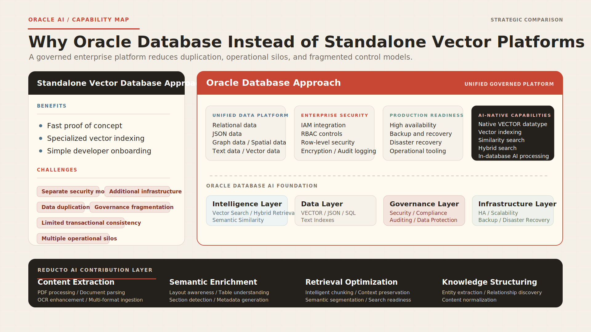

# Architecture



```text
10-K PDF, filing URL, or uploaded document
        |
        v
Demo / CLI request
        |
        | active structured path: POST /api/extract/url or ingest --mode extract
        v
Reducto Extract API
client.extract.run(input=..., instructions={"schema": ...}, settings={"citations": ...})
        |
        | response: schema-typed JSON, optional citations, job_id, studio_link, usage
        v
OracleDocumentRepository.store_extract_result
        |
        +--> documents.raw_reducto_output JSON
        +--> document_extractions.schema_json JSON
        +--> document_extractions.extracted_json JSON
        +--> document_extractions.raw_reducto_output JSON
        |
        v
Demo response
        |
        +--> route=/api/extract/url
        +--> backend_api=Reducto Extract API
        +--> reducto_endpoint=/extract
        +--> sdk_call=client.extract.run
        +--> request_body
        +--> extracted_json
        +--> document_id + extraction_id
```

Optional parse/RAG path: `client.parse.run(...)` still exists for chunking,
Oracle vectors, promoted table facts, and evidence-backed Q&A. It is not the
structured-field `/extract` integration path.

Key message: Reducto Extract produces typed JSON; Oracle stores and proves the
request, response, schema, and citations.
